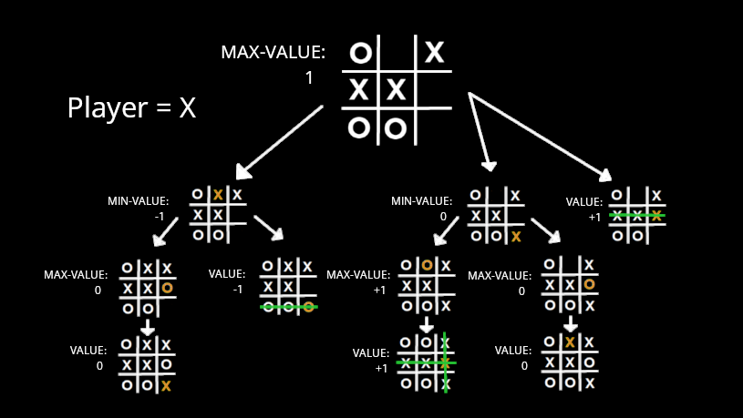

# tictactoe-ai
A simple Tic-Tac-Toe game written in Python and their pygame framework. Users play against an AI, 
which was implemented using the minimax algorithm.

## Introduction
This project was created as an introductory training project getting familiar with the pygame framework
and to get started with artifical intelligence and machine learning algorithms. The application is based on the online course 
"CS50’s Introduction to Artificial Intelligence with Python".

## Minimax Algorithm
The minimax is an algorithm to determine the best possible moves in two player zero-sum games. 
In these type of games the gain of an advantage of one player results automatically to an equivalent
disadvantage of the other player, so the net improvement in benefit of the game is zero.

### How the algorithm works
The minimax algorithm represents winning conditions in a mathematical way: one player wins (+1), the 
other player wins (-1) or the game results in a draw (0). Recursively, the algorithm search for the
best move in a simulation of all possible games beginning at the current state and until a terminal
state is reached. Every terminal state is marked with either (-1), (0) or (+1).

